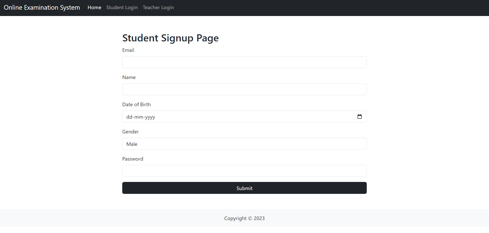
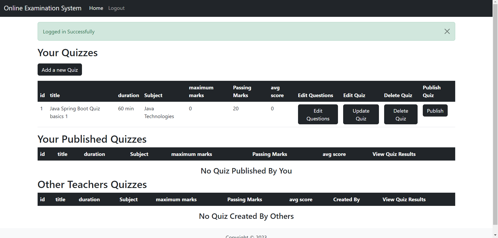
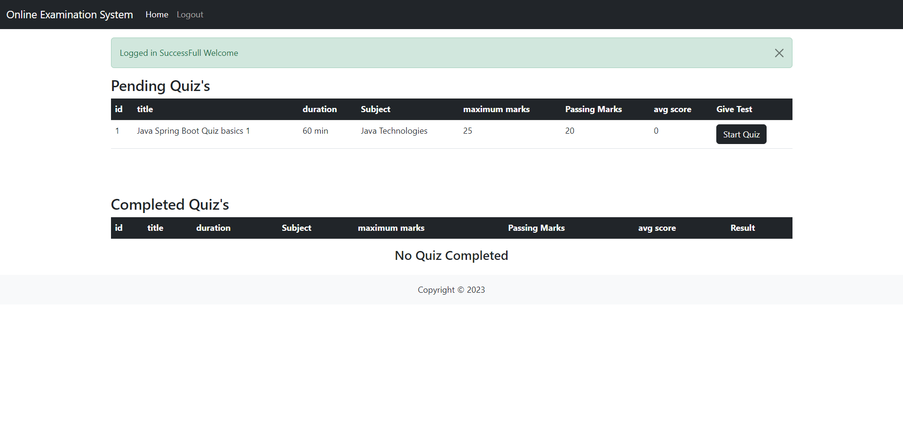
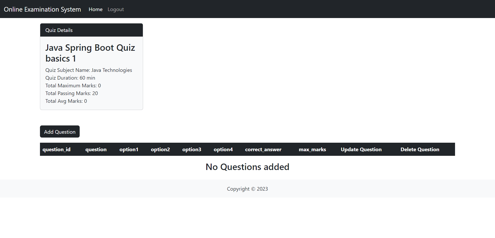
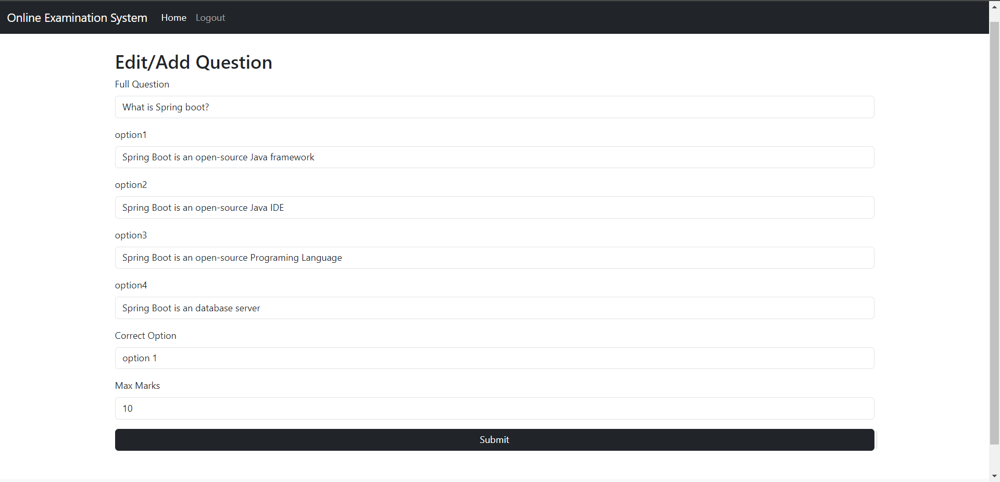
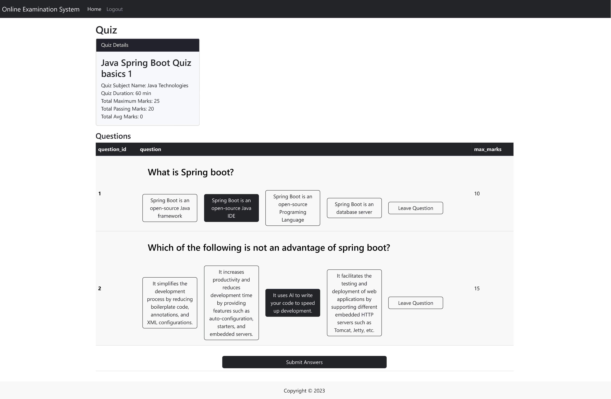
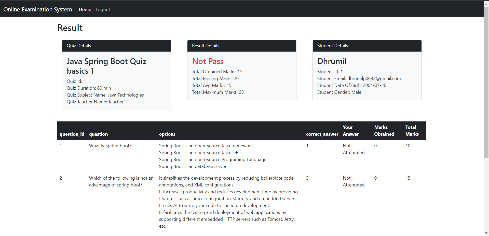

# TestZone

An amazing Java Spring Boot web application.

## Deployed at:

Website:

### Azure: https://testzonewebapp.azurewebsites.net/student/login

Database:

### Azure: jdbc:mysql://testzone.mysql.database.azure.com:3306/testzone

## Description:

TestZone is a quiz app that allows users to test their knowledge on a variety of topics. Users can create their own quizzes and share them with their friends. Users can also take quizzes created by other users.

Teachers can use this app to create quizzes for their students. Students can take these quizzes and their results will be automatically sent to the teacher.

TestZone focuses on providing fun and interactive way for users to make and take quizzes.

## How to run:

### Prerequisites:

- Java 17
- Maven
- MySQL

### Steps:

1. Clone the repository
2. Create a database named testzone in MySQL
3. Edit file named `application.properties` in `src/main/resources` folder or add enviroment variables to set the following properties:

```properties
spring.datasource.url=jdbc:mysql://localhost:3306/testzone
spring.datasource.username={your username}
spring.datasource.password={your password}
```

4. Run the following command in the root directory of the project or use your favorite IDE to run the project:

```bash
mvn spring-boot:run
```

5. Open `localhost:8080` in your browser

## Main Features:

### Login/Signup:

Users can create an account and login to the app. Users can sign up in both teacher and student roles.

Users need to provide their name, email, password, date of birth sign up.

Student Sign up:



### Home Page:

Students can view all the quizzes created by other Teachers.

Teachers can view all the quizzes created by them as well as can see quizzes created by other Teachers.

Teacher Home Page:



Students Home Page:



### Create And Update Quiz:

Teachers can create a quiz by providing a title, description, and a list of questions. Teachers can also update their quizzes.

Once created Teachers can publish their quizzes so that students can take them and teachers will be able to view their results.

After publishing quizzes cannot be updated.

Quiz home page:



Question add page:



### Take Quiz:

Students can take quizzes created by other teachers. Students can view their results after taking a quiz.

Quiz home page:



### Results:

Students and Teachers can view their results after taking a quiz.

Results page:



#### Contributors:

[@dhrumilpatel30](https://www.github.com/dhrumilpatel30)

[@Nilesh9106](https://www.github.com/Nilesh9106)
